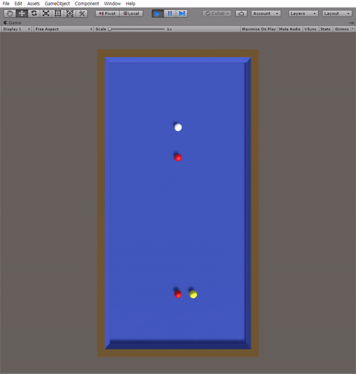
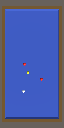

<p align="center">
    
</p>

# BilliardRL
# Introduction
This is a billiard environment, built with Unity.

## Agent
The yellow ball is a agent.

## Observation
This environment provides both visual observation and vector observation.

### Visual Observation


shape: (128, 64, 3)

### Vector Observation
[Y.x, Y.z, W.x, W.z, R1.x, R1.z, R2.x, R2.y]

(Y: yellow, W: white, R: red, x ∈ [-8.5, 8.5] , z ∈ [-18, 18])

## Action
There are 2 actions, theta(vectorAction[0]) and power(vectorAction[1]).  
Actions are processed in the environment as follows. 

theta = clip(vectorAction[0], 0, 1) * 2π   
power = clip(vectorAction[1], 1e-4, 1) * 2000

(**Note: If you put 0 in power, environment can't recognize it.**)

## Reward
Condition | Point | Terminal
:---: | :---: | :---:
Agent hit the white ball or nothing | -1 | True
Agent hit the only one red ball | 0 | True
Agent hit the only two red balls | 1 | False

# Installation
```cmd
git clone https://github.com/hyunho1027/BillardRL
```

## Requirements
- Python 3.6
- Unity ML-Agents v0.8

## Usage

```cmd
jupyter notebook getting-started.ipynb
```